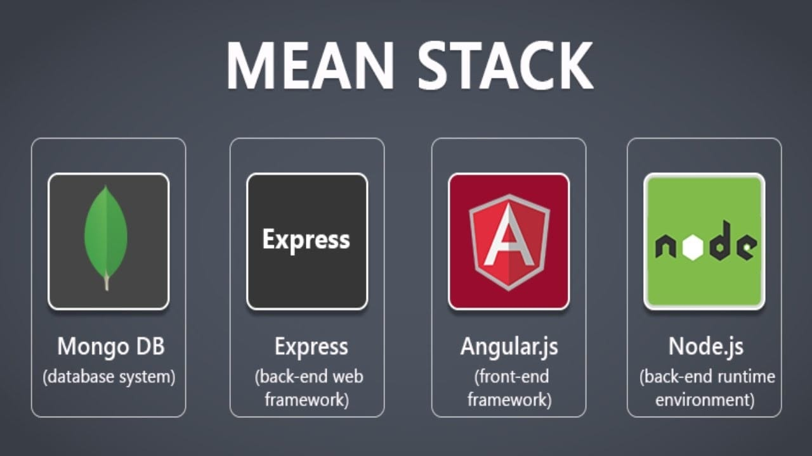
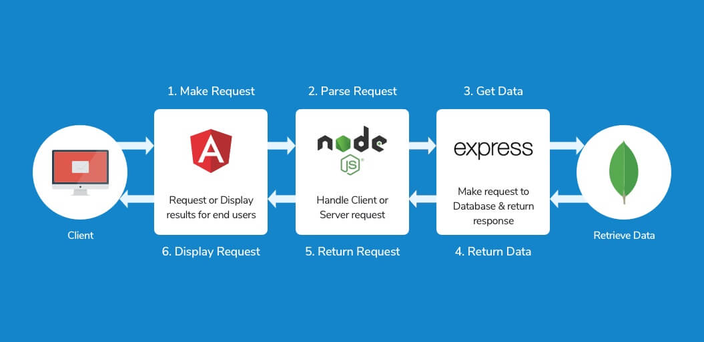

# Introduction to MEAN Stack
MEAN Stack is one of the most popular Technology Stack. It is used to develop a Full Stack Web Application. Although it is a Stack of different technologies, all of these are based on JavaScript language.

**MEAN Stands for:**
- M – MongoDB
- E – Express
- A – Angular
- N – Node.js

This stack leads to faster integrated development Web Application. Angular is Frontend Development Framework whereas Node.js, Express, and MongoDB are used for Backend development as shown in the below figure.
.

**What is MEAN Stack**

Flow of Information in MEAN Stack Applications is given each module communicates with the others in order to have a flow of the data from Server/Backend to Client/Frontend.
.

[a link](https://github.com/user/repo/blob/branch/other_file.md)